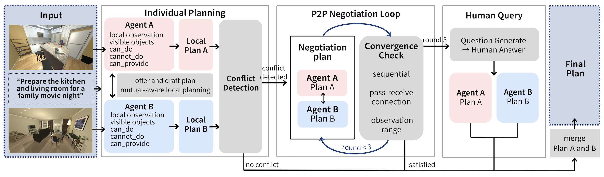

# 공간 분리 환경에서 Peer-to-Peer 협업 기반 Embodied 멀티에이전트 플래닝 프레임워크

**A Peer-to-Peer Collaboration-Based Embodied Multi-Agent Planning Framework for Spatially Separated Environments**

---

## 개요

스마트홈, 물류창고 등 공간적으로 분리된 환경에서는 각 에이전트가 자신의 구역에서만 시각 정보를 획득할 수 있습니다. 기존 멀티에이전트 연구는 중앙화된 오케스트레이터가 모든 관측을 수집하고 플랜을 조율하는 방식에 의존해왔지만, 이러한 구조는 다음과 같은 한계를 가집니다.

- 각 에이전트의 **로컬 컨텍스트가 플랜에 충분히 반영되기 어려움**
- 에이전트 수와 태스크 복잡도가 증가할수록 **중앙 처리 부담 증가**

본 연구는 오케스트레이터 없이 **Peer-to-Peer(P2P) 협상만으로 최종 플랜을 수립하는 프레임워크**를 제안합니다.

1. 각 에이전트가 로컬 시각 관측으로부터 구조화된 **Offer**와 초안 플랜을 독립적으로 생성
2. Offer와 초안 플랜을 상호 교환하여 **Mutual-Aware 로컬 플래닝** 수행
3. 충돌 발생 시 **P2P Negotiation Loop**를 통해 자율적으로 해소
4. 해소 불가한 예외적 케이스에만 **Human Query** 활성화

---

## 아키텍처

```
Individual Planning  →  P2P Negotiation Loop  →  Human Query (필요시)  →  Final Plan
```

<p align="center">
  
</p>

| 단계 | 설명 |
|---|---|
| **Individual Planning** | 각 에이전트가 로컬 이미지와 global task를 VLM에 입력하여 Offer(관측 객체, 수행 가능/불가 액션, PASS·RECEIVE 아이템)와 초안 플랜을 생성하고 상호 교환. Mutual-Aware 로컬 플래닝을 통해 PASS-RECEIVE 의존 관계를 반영하고, 충돌(시간적 자원 충돌, PASS-RECEIVE 연결 불일치, 동일 액션 중복 수행, 수행 불가능한 액션, 관측 범위 밖 객체 참조)이 없으면 규칙기반으로 즉시 병합 |
| **P2P Negotiation Loop** | 충돌 감지 시에만 진입. 매 라운드마다 각 에이전트가 수정 제안(스텝 간 의존성·실행 순서·액션 내용·스텝 삭제 범위 내)을 동시 생성하며, 상대 제안을 수락하거나 단일 에이전트만 수정을 제안한 스텝은 확정·잠금. 라운드 종료 시 수렴 조건(실행 순서 일관성, PASS-RECEIVE 연결 완결성, 관측 범위 내 액션 참조) 3가지를 검사하여 모두 충족되면 조기 종료 |
| **Human Query** | 최대 협상 라운드(3회) 도달 후에도 미해결 충돌이 존재하거나 양 에이전트가 서로 필요한 자원을 제공할 수 없는 경우에만 활성화 (전체의 10%). VLM이 자연어 질문 생성 → 사용자 답변 기반으로 스텝 유지/삭제 결정 → 규칙기반 플랜 병합 |

---

## 실험 환경

| 항목 | 내용 |
|---|---|
| 시뮬레이터 | AI2-THOR |
| 플래닝 모델 | GPT-4o |
| 평가 모델 | Gemini 3.5 Flash 기반 LLM Judge (RQ1 / RQ2 별도 설계) |
| 태스크 | Long-Horizon 가사 태스크 10종 |
| 환경 구성 | 주방·거실·침실·욕실 중 서로 다른 두 공간의 조합 |
| 총 실험 횟수 | 30회 (이미지 쌍 3개 × 태스크 10종) |

---

## 평가지표

모든 항목은 10점 만점 기준으로 산정되며, 최종 점수는 아래 가중 합산으로 산출됩니다.

```
Score = 0.40·TS + 0.25·PE + 0.10·OC + 0.25·SC
```

| 지표 | 가중치 | 설명 |
|---|---|---|
| **Task Success (TS)** | 0.40 | 최종 플랜이 태스크 목표를 얼마나 완전하게 달성하는지를 Task Description 내 목표 키워드 커버리지 비율로 평가 |
| **Plan Executability (PE)** | 0.25 | 플랜 내 각 액션의 물리적 실행 가능성을 평가. 비현실적이거나 수행 불가능한 액션 비율 기준 감점 |
| **Observability Consistency (OC)** | 0.10 | 플랜이 실제 관측 가능한 객체만을 사용하는지 평가. Object List에 없는 객체 사용(hallucination) 비율 기준 |
| **Sequential Coherence (SC)** | 0.25 | 플랜의 액션 순서가 논리적 선후 관계를 만족하는지 평가. 사전조건 위반 횟수 기준 |

---

## 실험 결과

### RQ1. Baseline 비교

제안 방법(Ours)을 **Independent**(에이전트 간 정보 교환 없이 로컬 관측만으로 독립 플랜 생성) 및 **Centralized**(단일 VLM이 두 환경의 관측 정보를 모두 입력받아 통합 플랜 생성) 방식과 비교했습니다.

| 방법 | TS | PE | OC | SC | Final Score |
|---|---|---|---|---|---|
| Independent | 5.53 | 3.80 | 4.90 | 4.53 | 4.17 |
| Centralized | 5.77 | 4.10 | 5.07 | 5.43 | 5.11 |
| **Ours** | **9.40** | **9.60** | **8.77** | **8.27** | **8.64** |

> RQ1은 **최종 계획**을 대상으로 협업 구조와 계획 품질을 평가하고, RQ2는 **추론 과정 전체 로그**를 대상으로 개별 플랜의 실행 가능성과 태스크 달성도를 평가합니다. 두 평가는 동일한 태스크에 대해 수행되었으나 평가 대상과 Judge 구조가 달라 점수가 직접 비교되지 않습니다.

- Independent 대비 Task Success **약 1.7배**, Centralized 대비 **약 1.6배** 향상
- 모든 지표에서 가장 높은 성능을 기록하며 제안 프레임워크가 더 높은 품질의 최종 플랜을 생성함을 확인

**비용 측면 (trade-off)**

| 지표 | Ours | Centralized | Independent |
|---|---|---|---|
| Planning Time (초) | 25.55 | 8.93 | 11.96 |
| Token Cost (누적 토큰 수) | 13,610.9 | 3,967.2 | 3,295.5 |

Offer 생성 및 반복적인 P2P 협상 과정으로 인해 Planning Time과 Token Cost는 베이스라인 대비 증가하며, 이는 품질 향상에 대한 비용-성능 trade-off로 해석됩니다.

---

### RQ2. Ablation Study

Offer Exchange와 Negotiation Loop를 각각 제거하여 구성 요소별 기여도를 분석했습니다. (RQ2는 추론 과정 전체 로그를 대상으로 별도 설계된 LLM Judge로 평가되어 RQ1과 점수를 직접 비교할 수 없습니다.)

| 설정 | TS | PE | OC | SC | Final Score |
|---|---|---|---|---|---|
| w/o Offer Exchange | 7.95 | 8.78 | 9.06 | 8.33 | 8.07 |
| w/o Negotiation Loop | 7.22 | 8.08 | 8.60 | 6.68 | 6.90 |
| **Full (Ours)** | **9.22** | **9.34** | **9.42** | **8.98** | **9.26** |

- **w/o Offer Exchange**: PASS-RECEIVE 관계 추론이 어려워 TS·SC에서 두드러진 감소
- **w/o Negotiation Loop**: 충돌 조정 없이 플랜이 병합되어 SC에서 가장 큰 저하
- 두 설정 간 성능 차이는 크지 않으며, 이는 Offer Exchange와 Negotiation Loop가 상호작용하며 최종 계획 품질에 함께 기여함을 시사

---

### 파이프라인 동작 분석

전체 30회 실험에서 각 단계가 처리된 비율입니다.

| 단계 | 건수 | 비율 |
|---|---|---|
| 충돌 없음 (Individual Planning에서 확정) | 12 | 40% |
| P2P Negotiation Loop 진입 | 15 | 50% |
| Human Query 활성화 | 3 | 10% |
| **합계** | **30** | **100%** |

전체의 **90%**가 에이전트 간 자율 협상만으로 해결되었으며, Negotiation Loop에 진입한 경우 대부분 3회 이내에 수렴했습니다. Human Query는 협상으로 해결되지 않는 예외적 경우를 위한 최종 안전장치로 기능합니다.

---

## 레포지토리 구조

```
p2p-planning/
├── Code_p2p/          # 전체 파이프라인 구현 코드
├── Data/              # 태스크 설명 및 환경 이미지 (AI2-THOR)
├── Prompts/
│   └── evaluation/    # 자동 평가용 LLM Judge 프롬프트
└── README.md
```

---

## 참고문헌

[1] Zhang, H. et al., *Building Cooperative Embodied Agents Modularly with Large Language Models*, ICLR, 2024.
[2] Brienza, M. et al., *Multi-agent Planning using Visual Language Models*, arXiv, 2024.
[3] Mandi, Z. et al., *RoCo: Dialectic Multi-Robot Collaboration with Large Language Models*, arXiv, 2023.
[4] Kolve, E. et al., *AI2-THOR: An Interactive 3D Environment for Visual AI*, arXiv, 2017.
[5] https://github.com/AMI-Collaboration/p2p-planning, 2026.

---

## Authors

최한비<sup>1</sup>, 신희재<sup>2</sup>, 정세원<sup>2</sup>, 이민수<sup>1,2,*</sup>

<sup>1</sup>성신여자대학교 미래융합기술공학과, <sup>2</sup>성신여자대학교 AI융합학부
